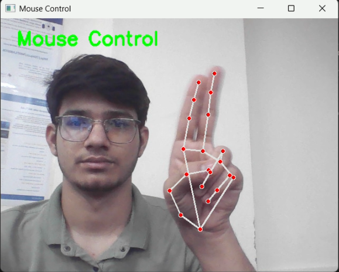
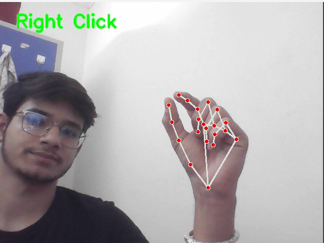
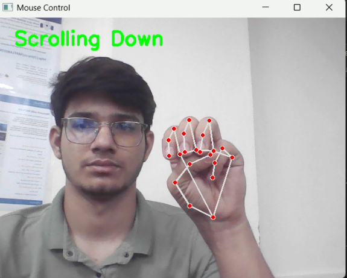
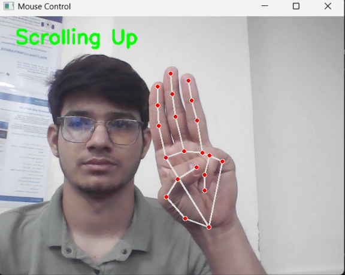

# Human-Computer Interaction using Computer Vision Techniques

## 📌 Overview

This project enables **touchless computer interaction** using hand gestures detected via a webcam. It uses **MediaPipe** for real-time hand tracking, **OpenCV** for camera input, and **PyAutoGUI** for mouse event simulation. With simple gestures, the user can:

- Move the mouse cursor
- Perform right-clicks
- Scroll up
- Scroll down

This offers a hygienic, intuitive alternative to physical input devices.

<p align="center">
  
  
  
  
</p>

## 🧠 Features

- 🖱️ **Mouse Cursor Control**: Move your index and middle fingers close together to move the mouse.
- 🖱️ **Right Click**: Bring your thumb and index finger close.
- 🔼 **Scroll Up**: Raise index, middle, and ring fingers.
- 🔽 **Scroll Down**: Make a fist (all fingers down).
- 📊 **Gesture Accuracy Report**: At the end of the session, an accuracy report is printed showing gesture detection and success rates.

## 🧰 Tools and Technologies

| Tool/Library | Purpose |
|--------------|---------|
| Python       | Programming Language |
| OpenCV       | Webcam Input and Frame Processing |
| MediaPipe    | Hand Landmark Detection |
| PyAutoGUI    | Simulating Mouse Control |
| Math, Time   | Distance Calculation and Delay Management |

## 🚀 How It Works

1. **Capture Webcam Feed** using OpenCV.
2. **Detect Hands and Landmarks** using MediaPipe.
3. **Interpret Gestures** using relative positions of hand landmarks.
4. **Simulate Mouse Events** using PyAutoGUI.
5. **Display Live Feedback** showing the gesture being recognized.
6. **Generate Gesture Report** after exit.

## 📂 Project Structure

```
gesture_mouse_control/
├── main.py              # Main Python script
├── README.md            # Project documentation
├── image/
│   └── image_demo.png    
├── project report
├── demo video
└── requirements.txt     # Required packages
```

## 🔧 Setup Instructions

### 1. Clone the Repository
```bash
git clone https://github.com/your-username/gesture-mouse-control.git
cd gesture-mouse-control
```

### 2. Install Dependencies
Create a `requirements.txt` with the following:
```txt
opencv-python
mediapipe
pyautogui
```
Then install:
```bash
pip install -r requirements.txt
```

### 3. Run the Project
```bash
python main.py
```

## 🔚 Exit the Program
Press **`q`** to quit the program window.

## 📚 References

- [MediaPipe Hands](https://mediapipe.readthedocs.io/en/latest/solutions/hands.html)
- [OpenCV Docs](https://docs.opencv.org/4.x/index.html)
- [PyAutoGUI Docs](https://pyautogui.readthedocs.io/en/latest/)

## 👨‍💻 Author

**Shubham Soni**  
Roll No: CS22B1053  
Under the guidance of **Dr. Dubacharla Gyaneshwar**  
CS323 - Computer Vision Project
